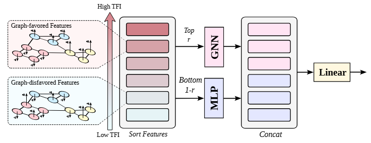

# Let Your Features Tell The Differences: Understanding Graph Convolution By Feature Splitting



This repository contains the official authors implementation associated with the paper "[Let Your Features Tell The Differences: Understanding Graph Convolution By Feature Splitting](https://openreview.net/forum?id=I9omfcWfMp)".

Abstract: Graph Neural Networks (GNNs) have demonstrated strong capabilities in processing structured data. While traditional GNNs typically treat each feature dimension equally important during graph convolution, we raise an important question: **Is the graph convolution operation equally beneficial for each feature?** If not, the convolution operation on certain feature dimensions can possibly lead to harmful effects, even worse than convolution-free models. Therefore, it is required to distinguish convolution-favored and convolution-disfavored features. Traditional feature selection methods mainly focus on identifying informative features or reducing redundancy, but they are not suitable for structured data as they overlook graph structures. In graph community, some studies have investigated the performance of GNN with respect to node features using feature homophily metrics, which assess feature consistency across graph topology. Unfortunately, these metrics do not effectively align with GNN performance and cannot be reliably used for feature selection in GNNs. To address these limitations, we introduce a novel metric, Topological Feature Informativeness (TFI), to distinguish GNN-favored and GNN-disfavored features, where its effectiveness is validated through both theoretical analysis and empirical observations. Based on TFI, we propose a simple yet effective Graph Feature Selection (GFS) method, which processes GNN-favored and GNN-disfavored features with GNNs and non-GNN models separately. Compared to original GNNs, GFS significantly improves the extraction of useful topological information from each feature with comparable computational costs. Extensive experiments show that after applying GFS to $\textbf{8}$ baseline and state-of-the-art (SOTA) GNN architectures across $\textbf{10}$ datasets, $\textbf{90\%}$ of the GFS-augmented cases show significant performance boosts. Furthermore, our proposed TFI metric outperforms other feature selection methods for GFS. These results verify the effectiveness of both GFS and TFI. Additionally, we demonstrate that GFS's improvements are robust to hyperparameter tuning, highlighting its potential as a universally valid method for enhancing various GNN architectures.

## Pre-requisites

1. NVIDIA GPU
2. Python >= 3.7

## Setup
1. Clone this repository
    ```shell
    # SSH
    git clone ggit@github.com:KTTRCDL/graph-feature-selection.git
    # HTTPS
    git clone https://github.com/KTTRCDL/graph-feature-selection.git
    ```
2. Install python requirements. 

    To reproduce results of our results, you need to install [PyTorch](https://pytorch.org/) and [DGL](https://www.dgl.ai/pages/start.html). Please refer [environment.yml](environment.yml) for the complete list of dependencies.
3. Download and preprocess datasets
    
    Download and preprocess the Children, Computers, Fitness, History, Photo, cora, pubmed, citeseer following the jupyter notebook [notebook/download_preprocess_datasets.ipynb](notebook/download_preprocess_datasets.ipynb)

## Running

To run the Graph Feature Selection (GFS), simple use
```shell
python train.py --name example --dataset Children --model GCN-MLP
```

<details>
<summary><span style="font-weight: bold;">Command Line Arguments for train.py  (click to expand)</span></summary>

*  Experiment Setup
    - `--name`: (type: str, default: `None`) - Experiment name. If None, model name is used.
    - `--save_dir`: (type: str, default: `'experiments'`) - Base directory for saving information.
    - `--dataset`: (type: str, default: `'Children'`) - Dataset name.

* Feature Selection
    - `--feature_norm_fn`: (type: str, default: `'z-norm'`) - Feature normalization function. Choices: `'None'`, `'z-norm'`, `'torch-norm'`.
    - `--node_selection_fn_name`: (type: str, default: `'mi_agg'`) - Feature selection function name. Choices: `'None'`, `'mi_agg'`.
    - `--ratio`: (type: float, default: `0.5`) - Split ratio for feature selection. If `ratio=1.0`, the GNN model is used directly.
    - `--node_selection_with_train_idx`: (default: `True`) - Use `train_idx` of split to select node features.

* Model Architecture
    - `--model`: (type: str, default: `'GCN-MLP'`) - Model architecture.
    - `--num_layers`: (type: int, default: `2`) - Number of layers in the model.
    - `--num_layers_1`: (type: int, default: `3`) - Number of layers in another model component.
    - `--hidden_dim`: (type: int, default: `512`) - Hidden layer dimension.
    - `--hidden_dim_1`: (type: int, default: `512`) - Hidden layer dimension in another model component.
    - `--hidden_dim_multiplier`: (type: float, default: `1`) - Hidden dimension multiplier.
    - `--num_heads`: (type: int, default: `8`) - Number of attention heads.
    - `--normalization`: (type: str, default: `'LayerNorm'`) - Normalization method. Choices: `'None'`, `'LayerNorm'`, `'BatchNorm'`.
    - `--graph_self_loop`: (default: `True`) - Enable graph self-loop.

* Regularization
    - `--dropout`: (type: float, default: `0.2`) - Dropout rate.
    - `--weight_decay`: (type: float, default: `0`) - Weight decay for regularization.

* Training Parameters
    - `--lr`: (type: float, default: `3e-5`) - Learning rate.
    - `--num_steps`: (type: int, default: `1000`) - Total number of training steps.
    - `--num_warmup_steps`: (type: int, default: `None`) - Number of warmup steps. If `None`, `warmup_proportion` is used.
    - `--warmup_proportion`: (type: float, default: `0`) - Proportion of warmup steps used if `num_warmup_steps` is `None`.
    - `--num_runs`: (type: int, default: `10`) - Number of training runs.

* Miscellaneous
    - `--device`: (type: str, default: `'cuda:0'`) - Device to use for training (e.g., `'cuda:0'` for GPU).
    - `--amp`: (default: `False`) - Enable automatic mixed precision (AMP) for training.
    - `--verbose`: (default: `False`) - Enable verbose logging.

</details>

The settings and result will be save at args.yaml and metrics.yaml in folder [experiments](experiments)

## More Example

For more example, please check [script/run_example.sh](script/run_example.sh) and run:
```shell
bash script/run_example.sh
```
